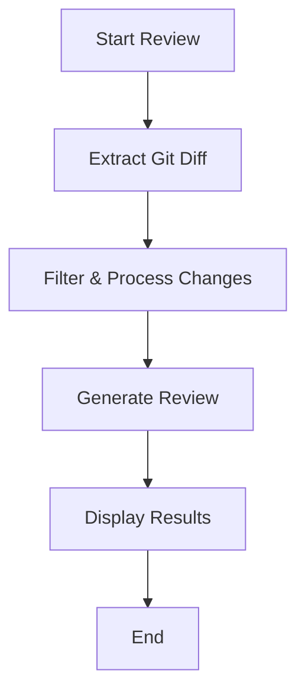

# PR-Agent (Streamlined)

A lightweight tool for AI-powered pull request reviews using local git repositories.

## Overview

PR-Agent is a tool that helps with pull request reviews using AI. This streamlined version focuses on local PR reviews with minimal dependencies.

## Features

- AI-powered code reviews for local git repositories
- Code suggestions and improvements
- PR description generation
- Support for local git repositories

## Quick Start

To run a PR review on your local repository:

```bash
python local_review.py --target-branch main --repo-path /path/to/your/repo
```

## Core Components

The streamlined PR-Agent consists of these key modules:

1. **agent/** - Contains the main PR agent implementation
2. **algo/** - Contains AI handlers, token handling, and PR processing logic
3. **git_providers/** - Git provider implementations with focus on local git
4. **tools/** - PR-related tools for reviews, descriptions, and code suggestions

## Requirements

- Python 3.12+
- Git repository
- LiteLLM compatible AI model (e.g., Ollama with a local model)

## Configuration

Configuration files are located in the `pr_agent/settings/` directory. The main configuration file is `configuration.toml`.


## Usage Examples

### Review a PR

Review the changes between your current branch and the main branch:

```bash
python local_review.py --target-branch main
```


## How It Works

PR-Agent provides AI-powered code reviews for local git repositories. Here's how it works:

### 1. Change Detection
- Analyzes the git diff between your current branch and the target branch
- Identifies all modified, added, and deleted files
- Processes file changes in a language-aware manner

### 2. Smart Filtering
- Focuses on source code and documentation changes
- Respects `.gitignore` and other exclusion patterns
- Skips binary and generated files

### 3. AI-Powered Review
- Uses LiteLLM to interface with AI models (supports Ollama and other providers)
- Analyzes code changes for potential issues and improvements
- Provides clear, actionable feedback

### 4. Results
- Displays review results directly in the terminal
- Highlights important findings and suggestions
- Maintains a clean and readable output format
- Provides code suggestions with explanations
- Highlights potential issues and improvements

### Workflow



### Key Components

1. **Local Git Provider**
   - Handles git operations
   - Manages repository state
   - Tracks changes between branches

2. **AI Handler**
   - Interfaces with LiteLLM
   - Manages model interactions
   - Handles token limits and batching

3. **Review Tools**
   - Code review analysis
   - Suggestion generation
   - PR description creation

4. **Configuration**
   - Customizable settings
   - Model parameters
   - File inclusion/exclusion rules
## Features

### Core Functionality

- **Code Review**: Get detailed AI-powered code reviews
**Local-First**: Works with local git repositories
- **Extensible**: Easily add new tools and integrations

### Supported Integrations

- **Version Control**: Git (local repositories)
- **AI Models**: Any model supported by LiteLLM (Ollama, OpenAI, etc.)
- **Editors**: Works with any editor or IDE

## Try It Out

To get started with PR-Agent, run the following command in your git repository:

```bash
python local_review.py --target-branch main
```

This will analyze your changes and provide feedback directly in the terminal.

## Getting Started

### Prerequisites

- Python 3.12 or higher
- Git installed and configured
- A local git repository with changes to review
- LiteLLM-compatible AI model (e.g., Ollama, OpenAI, etc.)

### Installation

1. Clone this repository:
   ```bash
   git clone https://github.com/your-username/pr-agent.git
   cd pr-agent
   ```

2. Install the required dependencies:
   ```bash
   pip install -r requirements.txt
   ```

### Basic Usage

1. Navigate to your git repository:
   ```bash
   cd /path/to/your/repo
   ```

2. Run a code review:
   ```bash
   python /path/to/pr-agent/local_review.py --target-branch main
   ```

### Available Commands

- `--target-branch`: The branch to compare against (default: main)
- `--repo-path`: Path to the git repository (default: current directory)
- `--tool`: Specify the tool to use (review, describe, improve)
- `--verbose`: Enable verbose output

## Configuration

PR-Agent can be configured using the `pr_agent/settings/configuration.toml` file. Key settings include:

- `openai.api_key`: Your OpenAI API key (if using OpenAI models)
- `model`: The AI model to use (e.g., "gpt-4", "claude-2")
- `max_tokens`: Maximum number of tokens to process at once
- `temperature`: Controls randomness in AI responses (0.0 to 1.0)

## License

This project is licensed under the MIT License - see the [LICENSE](LICENSE) file for details.

## Contributing

Contributions are welcome! Please feel free to submit a Pull Request.

## Support

For support, please open an issue in the GitHub repository.

## Privacy

This project is designed with privacy in mind. When using local models (like those provided by Ollama), your code never leaves your machine. If you choose to use cloud-based models (like OpenAI), please review their respective privacy policies.

## License

This project is licensed under the MIT License - see the [LICENSE](LICENSE) file for details.

---

Thank you for using PR-Agent! We hope this tool helps streamline your code review process. If you have any questions or run into any issues, please don't hesitate to open an issue in the repository.
