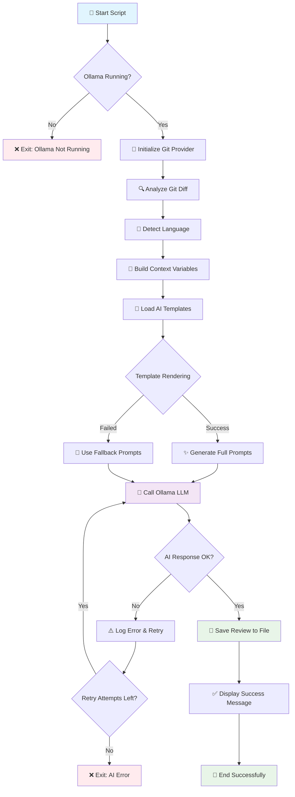

# PR-Agent Local Review - Process Flowchart

```mermaid
flowchart TD
    A[🚀 Start Script] --> B{Ollama Running?}
    B -->|No| Z1[❌ Exit: Ollama Not Running]
    B -->|Yes| C[📂 Initialize Git Provider]
    
    C --> D[🔍 Analyze Git Diff]
    D --> E[🎯 Detect Language]
    E --> F[📝 Build Context Variables]
    
    F --> G[🧠 Load AI Templates]
    G --> H{Template Rendering}
    
    H -->|Success| I[✨ Generate Full Prompts]
    H -->|Failed| J[🔄 Use Fallback Prompts]
    
    I --> K[🤖 Call Ollama LLM]
    J --> K
    
    K --> L{AI Response OK?}
    L -->|No| M[⚠️ Log Error & Retry]
    L -->|Yes| N[💾 Save Review to File]
    
    M --> O{Retry Attempts Left?}
    O -->|Yes| K
    O -->|No| Z2[❌ Exit: AI Error]
    
    N --> P[✅ Display Success Message]
    P --> Q[🎉 End Successfully]
    
    style A fill:#e1f5fe
    style K fill:#f3e5f5
    style N fill:#e8f5e8
    style Q fill:#e8f5e8
    style Z1 fill:#ffebee
    style Z2 fill:#ffebee
```
