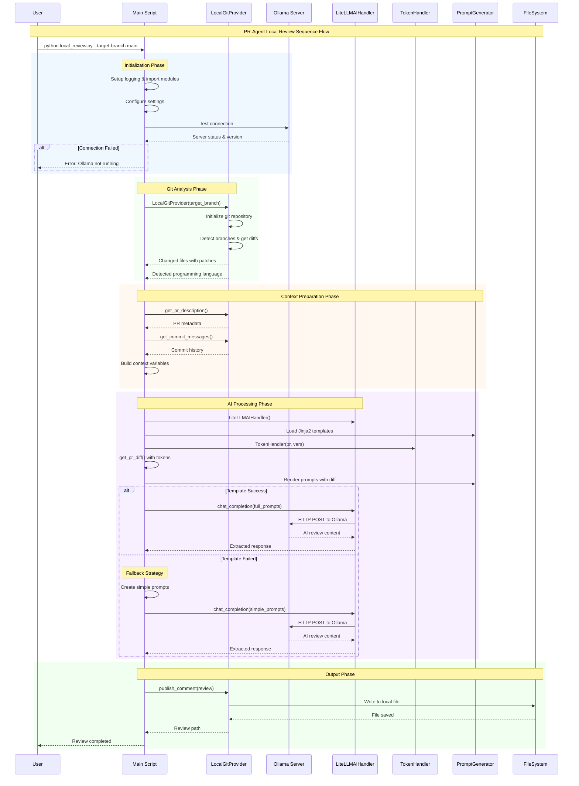

# PR-Agent Local Review - Sequence Diagram

```mermaid
sequenceDiagram
    participant U as User
    participant M as Main Script
    participant G as LocalGitProvider
    participant O as Ollama Server
    participant A as LiteLLMAIHandler
    participant T as TokenHandler
    participant P as PromptGenerator
    participant F as FileSystem

    Note over U,F: PR-Agent Local Review Sequence Flow

    U->>M: python local_review.py --target-branch main
    
    rect rgb(240, 248, 255)
        Note over M: Initialization Phase
        M->>M: Setup logging & import modules
        M->>M: Configure settings
        M->>O: Test connection
        O-->>M: Server status & version
        alt Connection Failed
            M-->>U: Error: Ollama not running
        end
    end

    rect rgb(245, 255, 245)
        Note over M,G: Git Analysis Phase
        M->>G: LocalGitProvider(target_branch)
        G->>G: Initialize git repository
        G->>G: Detect branches & get diffs
        G-->>M: Changed files with patches
        G-->>M: Detected programming language
    end

    rect rgb(255, 248, 240)
        Note over M,P: Context Preparation Phase
        M->>G: get_pr_description()
        G-->>M: PR metadata
        M->>G: get_commit_messages()
        G-->>M: Commit history
        M->>M: Build context variables
    end

    rect rgb(248, 240, 255)
        Note over M,A: AI Processing Phase
        M->>A: LiteLLMAIHandler()
        M->>P: Load Jinja2 templates
        M->>T: TokenHandler(pr, vars)
        M->>M: get_pr_diff() with tokens
        M->>P: Render prompts with diff
        
        alt Template Success
            M->>A: chat_completion(full_prompts)
            A->>O: HTTP POST to Ollama
            O-->>A: AI review content
            A-->>M: Extracted response
        else Template Failed
            Note over M: Fallback Strategy
            M->>M: Create simple prompts
            M->>A: chat_completion(simple_prompts)
            A->>O: HTTP POST to Ollama
            O-->>A: AI review content
            A-->>M: Extracted response
        end
    end

    rect rgb(240, 255, 240)
        Note over M,F: Output Phase
        M->>G: publish_comment(review)
        G->>F: Write to local file
        F-->>G: File saved
        G-->>M: Review path
        M-->>U: Review completed
    end
```
