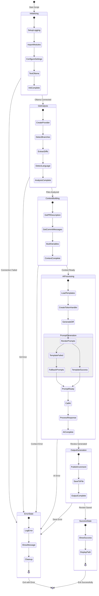

# PR-Agent Local Review - State Diagram

```mermaid
stateDiagram-v2
    [*] --> Initializing : Start Script

    state Initializing {
        [*] --> SetupLogging
        SetupLogging --> ImportModules
        ImportModules --> ConfigureSettings
        ConfigureSettings --> TestOllama
        TestOllama --> InitComplete
    }

    state GitAnalysis {
        [*] --> CreateProvider
        CreateProvider --> DetectBranches
        DetectBranches --> ExtractDiffs
        ExtractDiffs --> DetectLanguage
        DetectLanguage --> AnalysisComplete
    }

    state ContextBuilding {
        [*] --> GetPRDescription
        GetPRDescription --> GetCommitMessages
        GetCommitMessages --> BuildVariables
        BuildVariables --> ContextComplete
    }

    state AIProcessing {
        [*] --> LoadTemplates
        LoadTemplates --> CreateTokenHandler
        CreateTokenHandler --> GenerateDiff
        GenerateDiff --> RenderPrompts
        
        state PromptGeneration {
            RenderPrompts --> TemplateSuccess
            RenderPrompts --> TemplateFailed
            TemplateFailed --> FallbackPrompts
            FallbackPrompts --> PromptReady
            TemplateSuccess --> PromptReady
        }
        
        PromptReady --> CallAI
        CallAI --> ProcessResponse
        ProcessResponse --> AIComplete
    }

    state OutputGeneration {
        [*] --> PublishComment
        PublishComment --> SaveToFile
        SaveToFile --> OutputComplete
    }

    Initializing --> GitAnalysis : Ollama Connected
    Initializing --> ErrorState : Connection Failed
    
    GitAnalysis --> ContextBuilding : Files Analyzed
    GitAnalysis --> ErrorState : Git Error
    
    ContextBuilding --> AIProcessing : Context Ready
    ContextBuilding --> ErrorState : Context Error
    
    AIProcessing --> OutputGeneration : Review Generated
    AIProcessing --> ErrorState : AI Error
    
    OutputGeneration --> SuccessState : Review Saved
    OutputGeneration --> ErrorState : Save Error
    
    ErrorState --> [*] : Exit with Error
    SuccessState --> [*] : Exit Successfully

    state ErrorState {
        [*] --> LogError
        LogError --> ShowMessage
        ShowMessage --> Cleanup
        Cleanup --> [*]
    }

    state SuccessState {
        [*] --> ShowSuccess
        ShowSuccess --> DisplayPath
        DisplayPath --> [*]
    }
```
